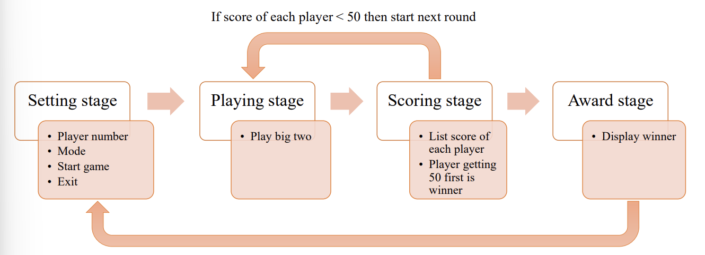

# Big Two Card Game Implementation

## Project Overview

### A. Game Interface
- **Player Setup:**  
  After entering the game interface, input the number of players (2-4) in the designated field.
- **Controls:**
  - **Game Start:** Click the *Game Start* button to begin the game.
  - **Exit:** Click the *Exit* button to quit the game.

### B. Starting the Game
- **First Player:**  
  The player holding the 3 of Clubs starts the game.
- **Turn Time:**  
  Each player must make a move within ten seconds during their turn.

### C. Playing Cards
- **Selecting Cards:**  
  Click on the card(s) you wish to play (selected cards will move upward).
- **Confirm Play:**  
  After selecting, click the *Play Card* button to play.
- **Passing:**  
  To skip your turn, click the *Pass* button. You cannot play again in the current round after passing.

### D. Automatic Actions on Time-Out
- **If Eligible to Play Any Card:**  
  The system automatically plays the leftmost card in your hand.
- **If Not Eligible:**  
  The system automatically passes your turn.

### E. Playing Rules
- **Compliance:**  
  Follow Big Two’s card combinations and ranking rules.
- **Invalid Moves:**  
  - If the selected card combination or ranking is invalid:
    - The system will display a text notification.
    - The move will be disallowed, and the player must choose again.

### F. Winning the Game
- **Victory Condition:**  
  The first player to play all their cards wins.
- **Scoring:**
  - Sum the remaining cards of all other players.
  - If a player has any 2s remaining, their remaining card count is doubled in the score calculation.

### G. Score Settlement and Game Continuation
- **Score Calculation:**  
  After settling scores:
  - If any player's score exceeds 50 points, the game ends.
  - Click *Back to Menu* to return to the main screen.
  - Otherwise, click *Next Round* to proceed to the next round.

### H. Returning to Main Menu During Gameplay
- **Exit to Menu:**  
  At any point during the game, click *Back to Menu* to return to the main screen.

## Game Design Flow

## Completed Features
- All fundamental game functionalities have been implemented
- Bonus Features
  - **Adjustable Player Count**: Players can set the total number of participants (2-4 players)
  - **Automatic Play on Timeout**: If a player does not make a move within ten seconds, the system will automatically play a card
  - **Game Table Information**: Additional feature displaying game information on the left side of the game screen
## Game Rules
1. Each player is dealt an equal number of cards, face down.
2. Begin the game by playing combination include the three of club.
3. Card are played in a counterclockwise direction.
4. The next player can either pass or follow the previous combination with higher-ranked.
5. If choosing to pass in this turn, you can’t play any card until this turn end.
6. When the other three players all pass, the turn ends.
7. Once everyone besides you have passed, you can play new combination and start a
new turn.
8. The first player who runs out of cards can get scores and a new round begin.
9. Player who get 50 scores first is winner.
##  Program Execution

### Terminal 1
1. Navigate to the project directory:
2. Generate the Makefile using qmake
   ```bash
   qmake-qt5
3. Compile the project
    ```bash
   make
### Terminal 2 
1. Start the X Window System
    ```bash
   startxwin
### Back to Terminal 1
1. Set the display environment variable
   ```bash
   export DISPLAY=:0.0
2. Run the Big Two game executable
   ```bash
   ./big_two


